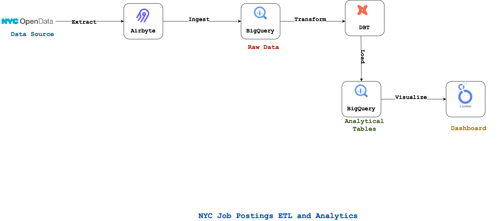
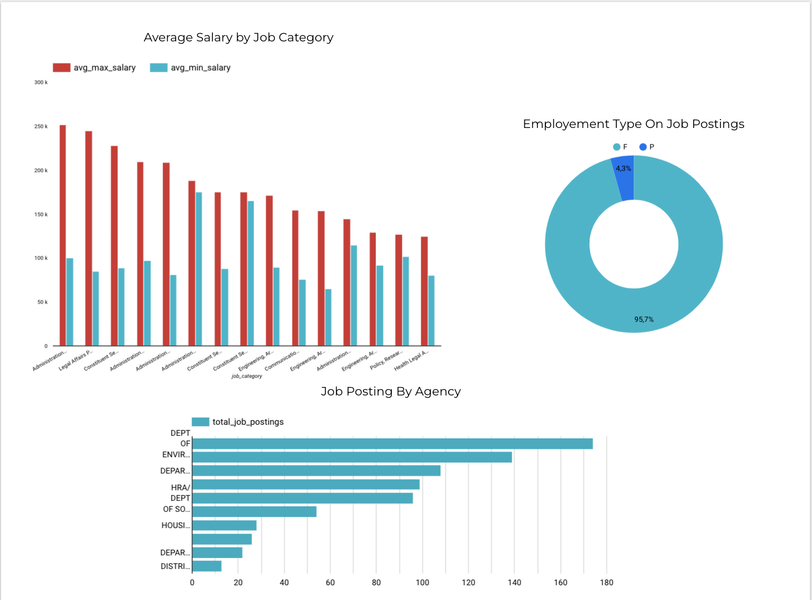
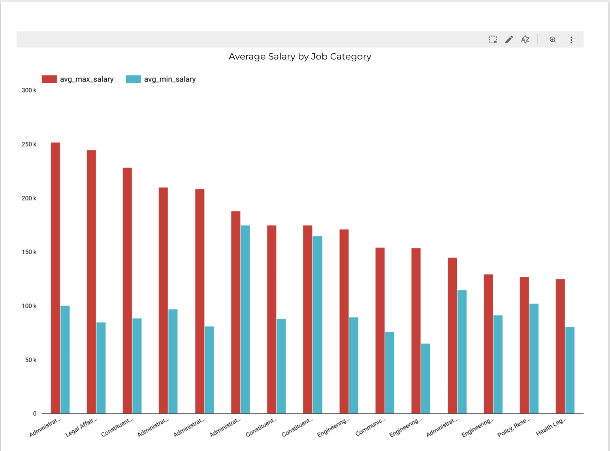
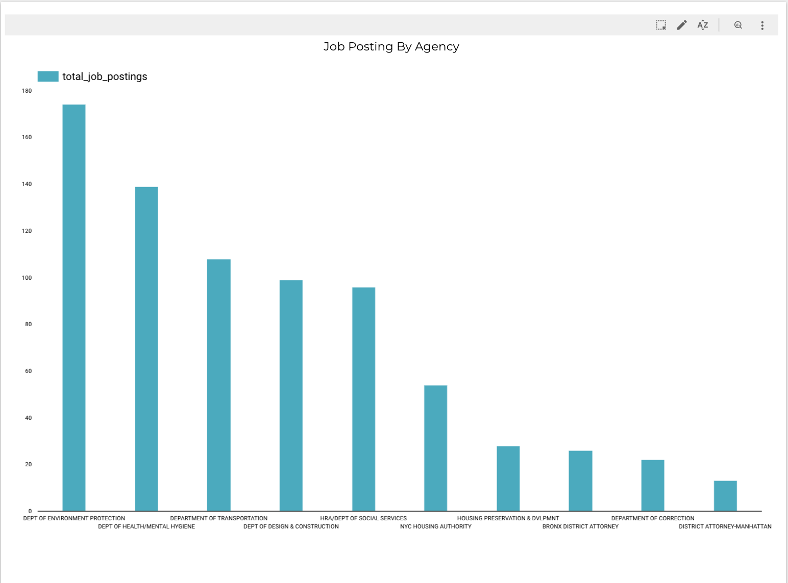

# dbt-bigquery
This project is based on Mazlum Tosun's tutorial named `ETL with DBT on Cloud Run Job` |(Ref: https://www.youtube.com/watch?v=I8bGWV0Pfug) 

By adaptating this toturial, I build an ETL that gives insights about job postings available on the City of New York’s official jobs site (http://www.nyc.gov/html/careers/html/search/search.shtml)


## Project Overview:
The goal of this project is to build a pipeline for the NYC Jobs dataset, performing data ingestion, transformation, and visualization to analyze job opportunities across different agencies, job categories, and time periods.

### Tools and Technologies Used
The tools used in this project are:
- `NYC Open Data API`: For accessing job postings data
- `Airbyte`:  For data ingestion and extraction from the NYC Open Data API
- `BigQuery`: For data storage and warehousing
- `DBT`: For data transformation and modeling
- `Looker Studio`: For data visualization and creating dashboards


## Project Architecture
The architecture of this project is descibed by the picture below:



## Project Folder Structure
```plaintext
.
├── README.md
├── configs
│   ├── Dockerfile
│   └── build-and-deploy-job.yaml
└── dbt
    ├── dbt_project.yml
    ├── macros
    │   └── average_salary.sql
    ├── models
    │   ├── marts
    │   │   ├── average_salary_by_job_category.sql
    │   │   ├── employment_type_count.sql
    │   │   └── job_count_by_agency.sql
    │   └── staging
    │       └── data-cleaning.sql
    ├── profiles.yml
    └── target
```
## Data Pipeline Components
### 1. Data Ingestion 
In the data ingestion stage, I use Airbyte to pull job postings data from the NYC Open Data API. Airbyte connects to the API and ingests data into BigQuery for storage.

### 2. Data Storage
In this stage, data is stored in BigQuery, Google's scalable data warehouse. BigQuery is used to centralize raw and transformed data, providing a secure, high-performance environment for data storage.

### 3. Data Transformation
Data transformation is handled by DBT (Data Build Tool), where SQL-based models clean, transform, and enrich the data for analysis. Key transformations in this project include:

- Cleaning and preprocessing job data
- Calculating KPIs such as average salaries, number of positions, and job distribution across agencies and categories
average max and min salaries by job category, number of positions posted by agency, and number of full-time and part-time positions posted

### 4. Data Visualization
Data visualization is achieved using Looker Stuido, which connects to BigQuery to create dashboards and visual reports. Key metrics and insights include:

Distribution of job postings by agency and category
Average salary analysis
Trends in job postings over time (number of full-time and part-time positions posted)


 

 

### Documentation: 
- NYC Open Data API Documentation: (https://opendata.cityofnewyork.us/how-to/) 
- Airbyte Documentation: (http://airbyte.com/)
- BigQuery Documentation: (https://cloud.google.com/bigquery/docs?hl=fr)
- DBT Documentation: (https://docs.getdbt.com/docs/get-started-dbt)
- Looker Studio: (https://support.google.com/looker-studio?hl=fr#topic=6267740)
